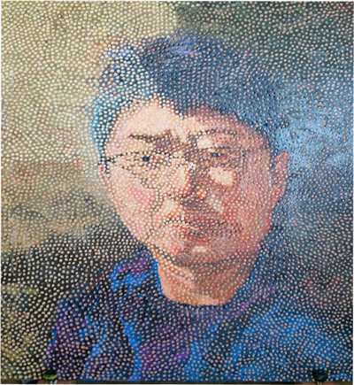
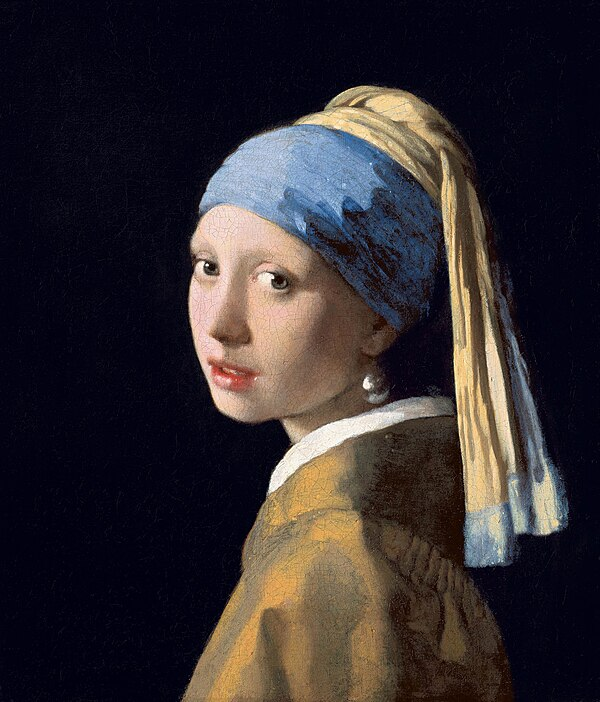
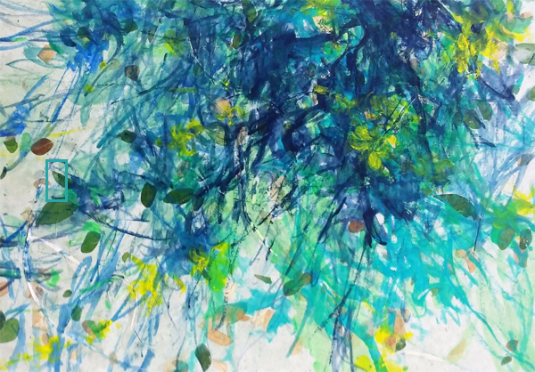

**2. CogAgent**

- **이미지에서 object 키워드 추출 prompting**
    
    > What are the main objects in this picture? Just pick 3 WORDs. Not sentence.
    > 
    - 일반 그림 ⇒ good
    - 풍경화 ⇒ good. 색상도 추출
        
        [0] : sea, sky, dolphin
        
        [1] : Tea plantation, hot air balloon, lake.
        
        [2] : trees, yellow, painting
        
    - 추상화
        
        [0] : paint, brush, water
        
        [1] : The main objects in this picture are yellow, green, and white.
        
        [2] : Black background, yellow striped area, circular shapes.
        
        ⇒ paint  : 키워드 추출할 거 없을 때 출력됨, 도형, 줄 등 설명 good
        
    - 인물화
        
        [0] :  girl, pearl earrings, headscarf
        
        [1] : Woman, hand, circle.
        
        [2] : This painting, composed of many small dots, depicts the portrait of a man wearing glasses.
        
        ⇒ 드로잉 기법 출력됨. 근데 키워드 3개 출력 프롬프트 따르지 않음.
        
- **이미지에서 그림 기법 등 추상적 감상 키워드 추출 prompting**
    
    > What is the painting techniques in this painting? Tell me main 3 techniques or object in this painting. Just 3 WORDS. Not SENTENCE.
    > 
    - 인물화
        
        
        
        Pointillism(점묘법), brush stroke, texture.
        
        
        
        oil painting, brush stroke, light and shadow
        
    - 추상화
        
        
        
        splash, drip, brush
        

### 조사해야 할 것들

- **입력 이미지 전처리**
    - 웹상의 깨끗한 이미지가 아닌 사용자가 찍은 사진. 조명/각도/화질/크기 등 편차가 큼.
        
        ⇒ 프론트 : 격자 UI 제공해 이미지의 대략적인 크기 통일
        
        ⇒ AI : 테두리 인식, super resolution 
        
- **이미지 종류별 키워드 prompting 방법**
    - 인물/풍경/추상/일반 그림에 따라 추출할 수 있는 키워드의 종류가 다름.
    - 현재는 일반적인 그림 대상 객체 추출하는 방식.
        
        ⇒ 인물/추상화 prompting 작업 필요
        
- **키워드와 좌표 매칭**
    - 추출한 키워드 → prompting → 좌표 : 키워드와 다른 부분을 focus하는 경우 발생.
    - 좌표 prompting의 답변의 비일관성 : 좌표 추출 일반화X
    - 키워드를 prompting을 통해 좌표를 찾는데 정확도 측면에서 한계 존재.
    
    ⇒ 미술작품 objectdetection api 
    
    또는 
    
    ⇒ 추출한 키워드와 별개로 좌표만 사용 → 좌표로 focus된 부분 새로운 이미지로 저장 → 다시 prompting 수행
    
- **객체 키워드 vs 감상 포인트 비율 조정**
    - 그림에서 단순 객체 추출 및 설명은 필요X
    - 드로잉 기법 등 감상 포인트 prompting 필요
- **한국어로 변환**
- **UI 구성**
    
    ⇒ focus된 부분을 사용자가 선택하도록 → 확대& 키워드 &설명
    
    또는
    
    ⇒ 한번에 제공
    
    ⇒ super resolution
    
    ⇒ vlm 
    